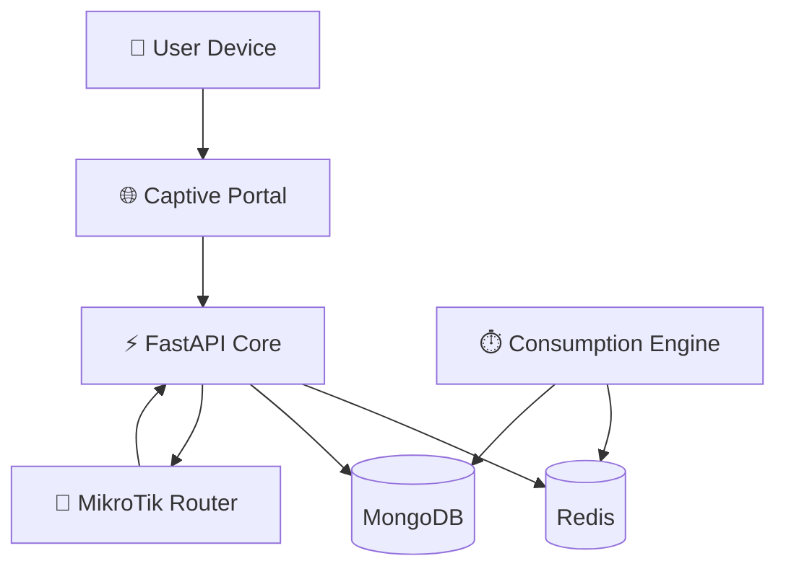
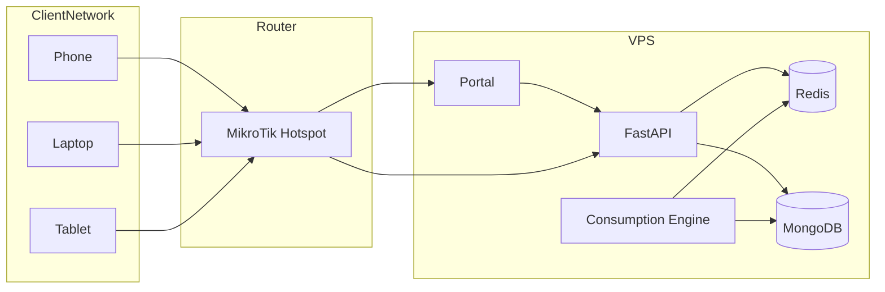
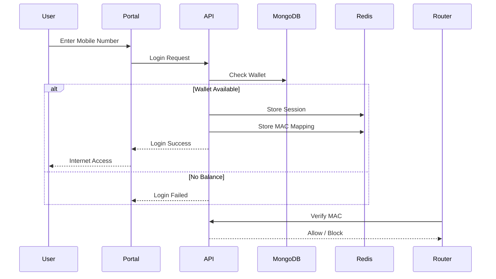
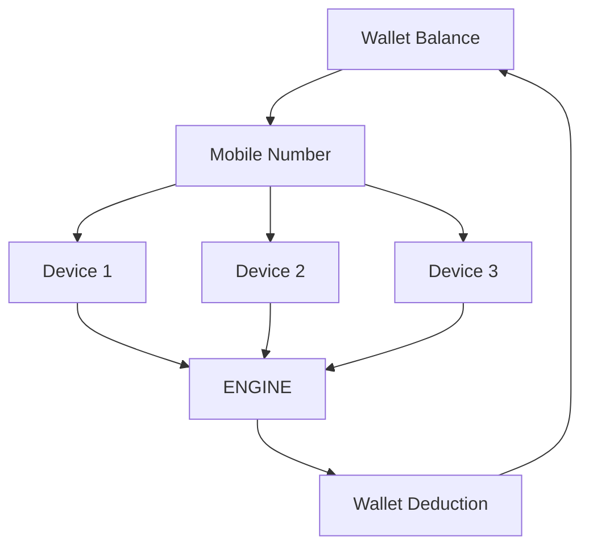
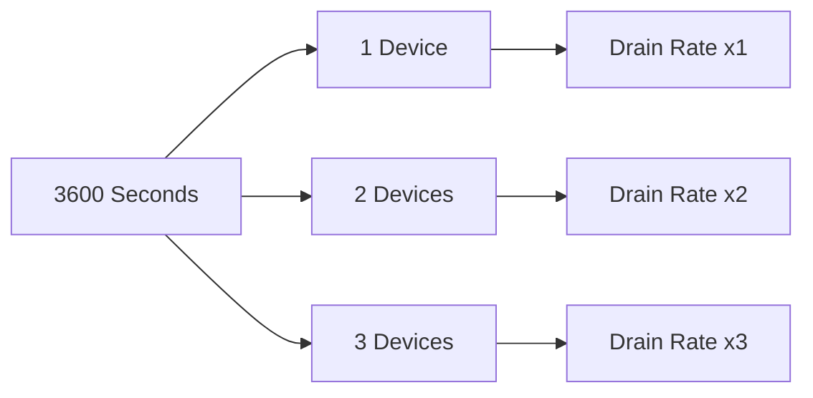
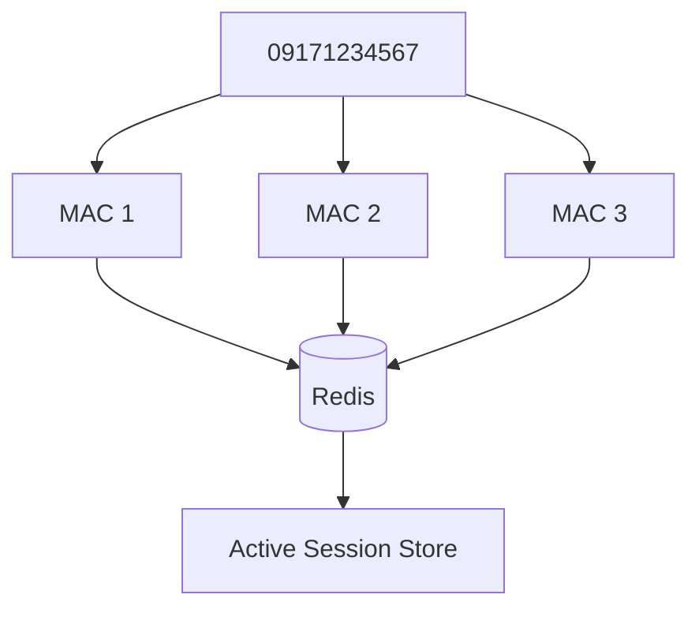
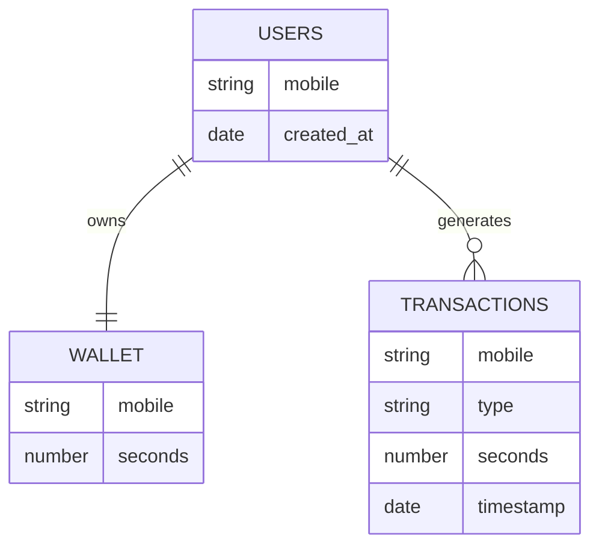
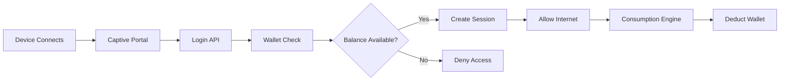
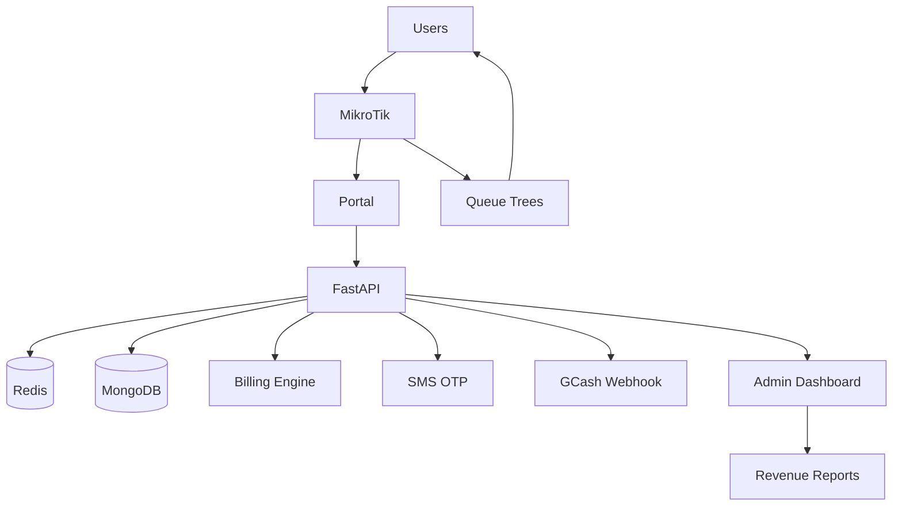

# 🏗️ System Architecture

## High-Level Architecture



---

## Production Deployment Topology



---

## Authentication Flow



---

## Wallet Consumption Architecture



---

## Shared Wallet Logic



### Rule

```text
More devices ≠ more time

More devices = faster consumption
of the same wallet balance.
```

---

## Redis Session Model



---

## MongoDB Data Model



---

## Request Lifecycle



---

## Future ISP v7 Architecture




TP-Link Archer C6 WiFi
        ↓
User connects
        ↓
DNS resolves normally (but blocked internet)
        ↓
User forced to portal page
        ↓
Flask Portal (7777)
        ↓
FastAPI (8000 login check)
        ↓
Redis session + MongoDB wallet